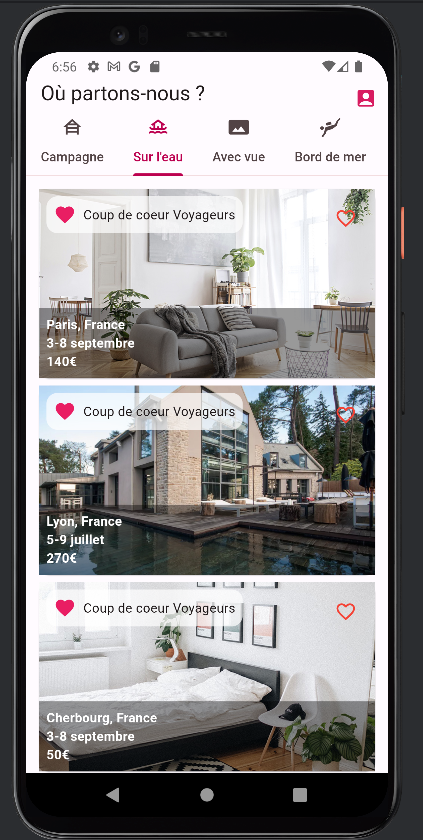

# airbnb_page

### Description

Ce projet consiste en la création d'une page d'accueil pour une application de réservation de logements, inspirée de la 
célèbre plateforme Airbnb. Elle vise à offrir une expérience utilisateur intuitive et agréable en présentant les logements 
disponibles.

### Technologies Utilisées
* Flutter: Cadre de développement pour une interface riche sur iOS et Android.
* Dart: Langage de programmation pour la logique métier et la structuration des composants de l'application.

### Run App

```bash
flutter run
```

### Aperçu de l'interface

